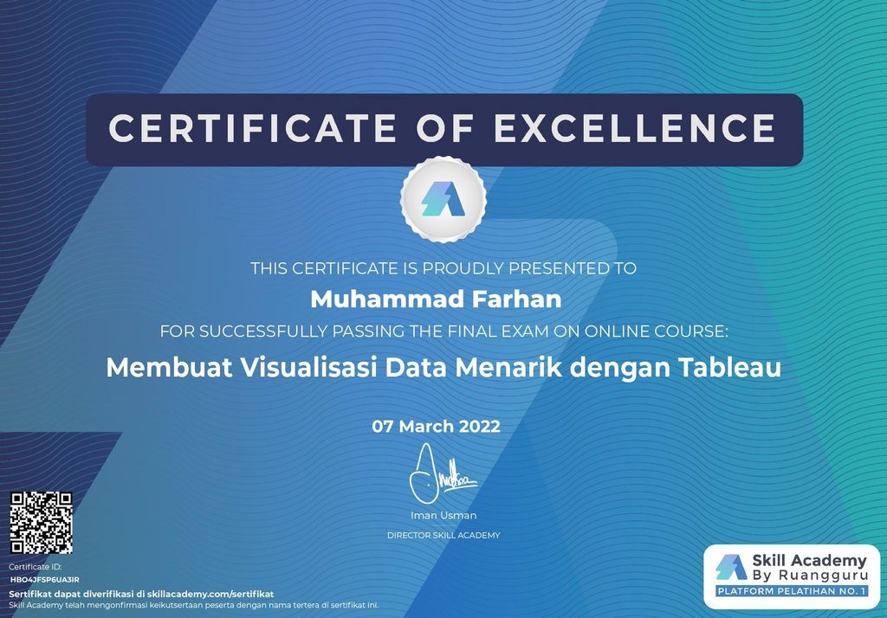

  

 

<h1 align="center">Skill Academy - Membuat Visualisasi Data Menarik dengan Tableau</h1>

  Repositori ini berisi tentang hasil pembelajaran saya selama mengikuti course <strong>Membuat Visualisasi Data Menarik dengan Tableau</strong> dari <strong>Skill Academy</strong>.

  Tools Visualisasi :

  Source Data : 

<a> <strong>Skill Academy</strong> </a>

Portofolio Dashboard

  

 

  Dashboard Diatas berisi informasi terkait rantai penjualan kopi di negara Amerika Serikat.

 

Certificate of Completion

 

  

 
  
 

  Notes : Link menuju Tableau Public bisa klik logo Tableau di atas.

